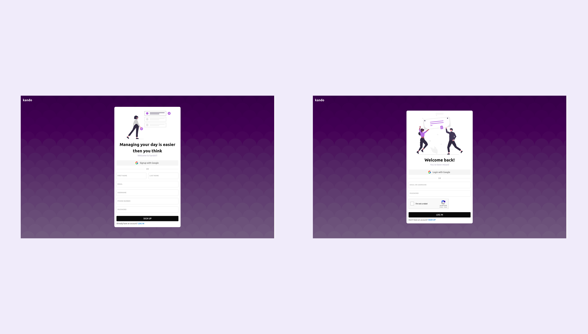
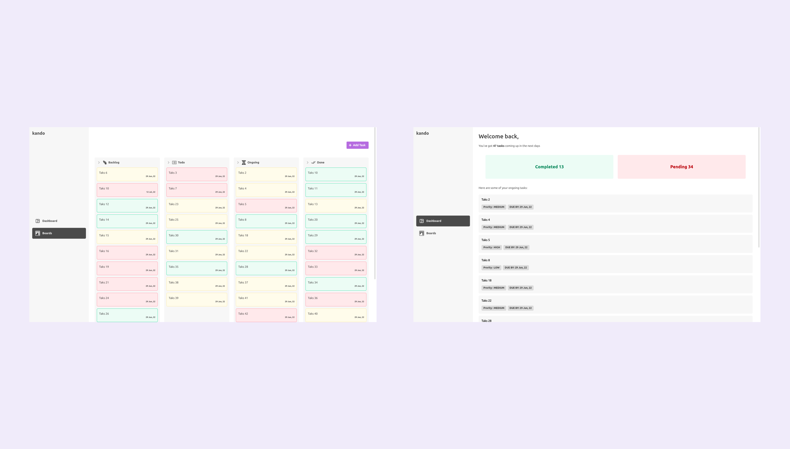

# Kando


## Screenshots





## Run Locally

Clone the project

```bash
  git clone https://github.com/dhruvindsd-dev/kanban_frontend
```

Go to the project directory
a
```bash
  cd my-project
```

Install dependencies

```bash
  npm install
```

Start the server

```bash
  npm dev
```
